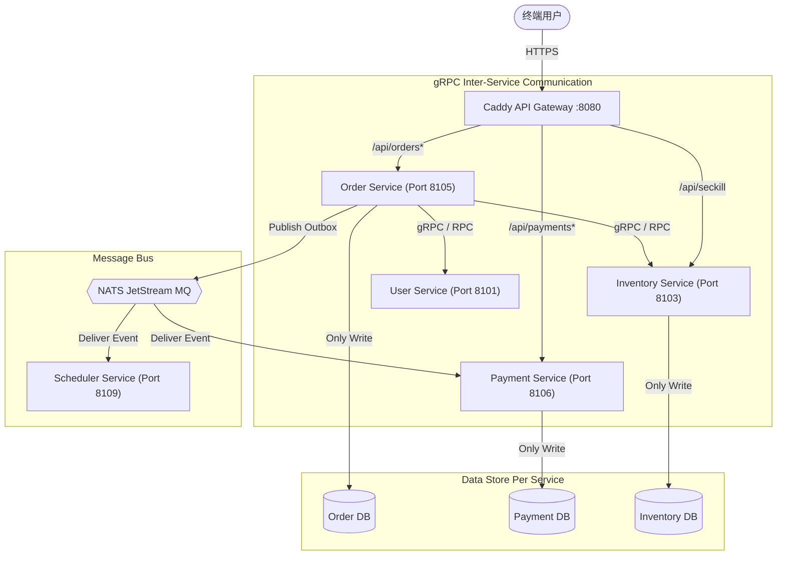
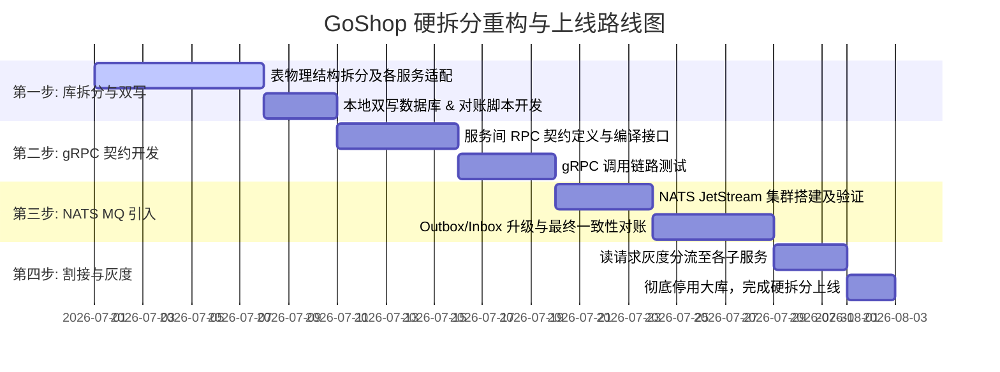

# GoShop 物理微服务硬拆分与消息队列 (MQ) 引入演进方案

本方案旨在将 GoShop 从当前的“共享数据库与 Valkey 过渡期微服务（软拆分）”架构，平滑且彻底地升级重构为**真正的物理微服务（硬拆分）**架构，并引入 **NATS JetStream** 作为企业级消息队列，以解决微服务在数据一致性、通信耦合和高并发削峰上的痛点。

---

## 目录

1. [设计原则与演进目标](#1-设计原则与演进目标)
2. [第一阶段：数据库独立与 Schema 拆分方案](#2-第一阶段数据库独立与-schema-拆分方案)
3. [第二阶段：跨服务通信 gRPC 改造方案](#3-第二阶段跨服务通信-grpc-改造方案)
4. [第三阶段：引入 NATS JetStream 消息队列](#4-第三阶段引入-nats-jetstream-消息队列)
5. [第四阶段：保障最终一致性的 Outbox + Inbox 模式](#5-第四阶段保障最终一致性的-outbox--inbox-模式)
6. [灰度上线与数据迁移路线图](#6-灰度上线与数据迁移路线图)

---

## 1. 设计原则与演进目标

在进行微服务“硬拆分”时，必须遵循以下核心原则：
* **Database-per-Service (服务专属库)**：每个微服务独占其数据库，其它服务严禁跨库或直接读写非本服务的表。
* **契约优先通信 (Contract-First)**：服务间通信采用 **gRPC (HTTP/2)**，以 Protobuf 作为强类型契约进行隔离，代替内存级 GORM 调用。
* **异步事件驱动 (Event-Driven)**：服务间非核心链路（如支付成功后发送通知、派发优惠券、生成财务对账流水）全部改用消息队列（MQ）进行异步解耦。
* **最终一致性保证 (Transactional Outbox/Inbox)**：跨服务的状态修改，通过本地事务 Outbox 写入事件，MQ 投递，消费端 Inbox 幂等表防重消费来确保一致性。



---

## 2. 第一阶段：数据库独立与 Schema 拆分方案

### 2.1 拆分数据库定义

将现有的单体大表关系物理分割为 8 个独立的 PostgreSQL 数据库或独立物理 Schema：

| 微服务名称 | 承载数据表 |
| :--- | :--- |
| **goshop-user-service** | `users`, `addresses` |
| **goshop-product-service** | `categories`, `spus`, `skus` |
| **goshop-inventory-service** | `sku_inventories`, `inventory_reservations`, `inventory_journals` |
| **goshop-promotion-service** | `coupons`, `user_coupons` |
| **goshop-order-service** | `orders`, `order_items`, `order_promotion_allocations`, `order_state_logs`, `dead_letter_orders` |
| **goshop-payment-service** | `payment_orders`, `payment_transactions` |
| **goshop-aftersale-service** | `after_sale_orders`, `after_sale_items`, `refund_orders`, `accounting_entries` |
| **goshop-cart-service** | `cart_items` |

### 2.2 彻底废除跨库 JOIN

原本的 SQL 联表查询（如在订单列表展示商品标题、图片）在数据库隔离后将失效。改造方案如下：
1. **数据冗余设计 (Redundancy)**：
   在 `order_items` 表中冗余存储下单时的商品快照信息：`spu_id`、`sku_id`、`sku_title`、`sku_image` 和下单单价。生成订单时一次性固化，后续订单展现直接读取本地表，**免去查询商品服务的开销**。
2. **数据内存组装 (In-Memory Aggregation)**：
   若需展现实时数据，应由 API 网关或调用端服务通过 ID 列表批量请求目标服务获取（如订单列表分页展示时，批量向商品服务查询商品实时状态并在内存组装），严禁直接在数据库层进行 CROSS-JOIN。

---

## 3. 第二阶段：跨服务通信 gRPC 改造方案

### 3.1 gRPC 技术栈选型
服务间同步调用（例如：订单服务下单前需要扣减/预占库存、锁定优惠券）采用 **gRPC (Go GoProto)**。
* 编写 Protobuf 协议文件契约，存放于统一的组件库（例如 `github.com/GoShop/goshop-proto`）。

### 3.2 Protobuf 契约定义示例 (库存预占)

```protobuf
syntax = "proto3";

package goshop.inventory.v1;
option go_package = "github.com/GoShop/goshop-proto/inventory/v1;inventoryv1";

service InventoryService {
  // 预占商品 SKU 库存
  rpc ReserveStock (ReserveStockRequest) returns (ReserveStockResponse);
  // 确认并转为扣减预占库存
  rpc ConfirmStock (ConfirmStockRequest) returns (ConfirmStockResponse);
  // 释放预占库存
  rpc ReleaseStock (ReleaseStockRequest) returns (ReleaseStockResponse);
}

message ReserveStockRequest {
  string order_id = 1;
  uint64 user_id = 2;
  repeated StockItem items = 3;
}

message StockItem {
  uint64 sku_id = 1;
  int32 quantity = 2;
}

message ReserveStockResponse {
  bool success = 1;
  string message = 2;
}

// ... Confirm / Release 结构类似
```

### 3.3 数据库读写分离与 gRPC 网关集成

* **读操作降级走副本**：在服务间 gRPC 通信中，涉及高频读（如商品检索、购物车拉取）可直接使用对应服务的从库（Read Replica），写操作（如库存预占、锁定优惠券）强制走主库事务。
* **本地调试代理 (Caddy)**：
  在多进程运行时中，本地开发网关（`deploy/Caddyfile.microservices`）支持 HTTP/2 grpc 协议转发，可配置 Caddy 针对 gRPC 端口进行统一服务路由分发。

---

## 4. 第三阶段：引入 NATS JetStream 消息队列

### 4.1 为什么选择 NATS JetStream
* **云原生纯 Go 架构**：无 JVM/Erlang 重型依赖，与 Go 社区生态完美契合，本地测试支持直接嵌入式启动。
* **JetStream 持久化模型**：支持在 Disk/Memory 上建立持久化 Stream，支持 At-Least-Once (至少一次) 和 At-Most-Once 投递策略。
* **高性能削峰**：在高并发秒杀路由 `/api/seckill` 中，库存预占成功后，通过 NATS JetStream 高速管道异步发送“订单创建”事件，下游订单服务以拉取（Pull Consumer）模式逐步消费消息落库，有效消除数据库写入瓶颈。

### 4.2 NATS 集群拓扑结构

```text
               +-----------------------+
               |  NATS JetStream Node1 |
               +-----------+-----------+
                           |
            +--------------+--------------+
            |                             |
+-----------+-----------+     +-----------+-----------+
|  NATS JetStream Node2 |     |  NATS JetStream Node3 |
+-----------------------+     +-----------------------+
```
生产环境部署三个 NATS 节点组成 RAFT 强一致性副本集群，设置 `Stream Replica = 3`。

---

## 5. 第四阶段：保障最终一致性的 Outbox + Inbox 模式

为避免“业务落库成功但发消息失败”或“MQ投递成功但本地事务回滚”的脑裂现象，采用 **Transactional Outbox + Inbox** 保证服务间的最终一致性。

### 5.1 事务事件发布流程 (以“支付成功”为例)

1. **本地事务写入**：
   在 `goshop-payment-service` 中，当收到三方支付回调通知且验证金额无误后，在同一个 **PostgreSQL 本地事务**中完成两件事：
   * 将支付单状态改为 `PAID`。
   * 向 `outbox_events` 表写入一条类型为 `payment.paid` 的事件数据（状态 `status = 0 (待发送)`）。
2. **事件可靠提取与投递**：
   * `goshop-scheduler-service` 轮询本服务的 `outbox_events` 表，或者各服务自己运行后台 publisher。
   * 读取未发送事件，发布到 **NATS JetStream** 主题 `goshop.events.payment.paid`。
   * 收到 NATS 的 ACK 确认后，将本地 `outbox_events` 事件状态更新为 `status = 1 (已发送)`。

```
[Payment Service Transaction]
  ├─ 1. Update PaymentOrder to PAID
  └─ 2. Insert OutboxEvent (payment.paid, status=PENDING)
                      │
           (Scheduler Polls DB)
                      │
                      ▼
            Publish Event to NATS MQ
                      │
           (NATS ACKs Confirmation)
                      │
                      ▼
        Update OutboxEvent (status=SENT)
```

### 5.2 幂等消费者消费流程 (以“订单服务”接收“支付成功”为例)

1. **消费与落库本地事务**：
   `goshop-order-service` 订阅 `goshop.events.payment.paid` 队列：
   * 收到消息后，首先提取消息 ID（如 UUID 格式的 `event_id`）。
   * 开启订单服务数据库本地事务：
     * 查询本地 `inbox_events` 幂等表。如果该 `event_id` 已经存在，说明消息已处理，**直接 ACK 消息并幂等退出**。
     * 执行业务逻辑：更新订单状态为已支付（`status = 20`）、扣减预占库存并写状态日志。
     * 向 `inbox_events` 插入 `event_id`，并记录处理时间。
     * 提交事务。
2. **ACK 确认机制**：
   Only when the order service transaction commits successfully does it ACK the message back to NATS. If it crashes or database insertion fails mid-way, the transaction rolls back, and NATS will automatically re-deliver the message.

---

## 6. 灰度上线与数据迁移路线图

为确保企业级线上系统无缝割接，不影响正常用户交易，采用四步迁移路线：



### 6.1 数据割接对账兜底 (Reconciliation)
在迁移过渡期间，运行后台一致性对账脚本。每隔 15 分钟比对各微服务表与老单体大数据库表之间的数据差异。确认数据副本完全一致后，再切换 Caddy 路由，逐步切断老单体大库的写入，完成完全解耦的企业级线上演进。
