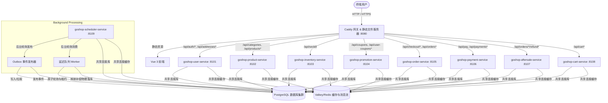

# GoShop 企业级高可用电商平台完全上线与重构计划书

本项目旨在将 GoShop 从高并发秒杀原型系统，升级重构为具备完全生产级交付能力、极致安全、高可观测性且支持多模块横向扩展的“企业级电商平台”，可以直接部署上线并接入商业运营。

---

## 当前落地状态（2026-07-01）

已完成：

- Phase 1 交易闭环：后端价格试算、优惠券锁定/确认/释放、库存预占/确认/释放、支付单、mock 回调幂等、订单状态日志、整单/部分售后退款、退款财务流水。
- 可靠延迟队列：统一 `delay:order_payment_timeout`，Redis Lua 原子抢占，processing 租约，DLQ，数据库兜底扫描。
- 微服务过渡形态：新增 `cmd/goshop-*-service` 多进程入口，Caddy 路由样例，systemd 样例，scheduler 独立运行延迟队列与 Outbox 发布器。
- 最终一致性基础：新增 `outbox_events`/`inbox_events`，订单/支付/售后事务内写 Outbox，scheduler 发布到 Redis Stream `goshop:events`。
- 委托材料：`docs/delegation_prompts.md` 已提供测试扩展、文档 QA、部署脚本 agent prompt。

仍需后续硬拆分（具体设计与路线详见 [物理微服务硬拆分与消息队列演进方案](file:///home/lzzz/MyProjects/GoShop/docs/hard_split_and_mq_plan.md)）：

- 每个服务独立 schema/database 和最小权限账号。
- 订单服务通过 API/gRPC 获取商品、库存、营销、用户快照，停止直接跨域查库。
- Redis Stream 发布器升级为 NATS JetStream 或 RabbitMQ，并补齐 Inbox 幂等消费者。
- 独立 Admin 前端、生产级支付渠道验签、对账任务、Cloudflare Tunnel 实机部署。

---

## 一、 系统架构蓝图 (Architecture Blueprint)

### 1. 模块化单体架构 (Monolith Architecture)

在开发与初期上线阶段，推荐采用 **模块化单体运行时**，将所有业务模块运行在单一进程中，易于维护与部署。

```mermaid
graph TD
    User([终端用户]) -->|HTTPS / WSS| Nginx[Nginx 反向代理 & SSL 终止]
    Nginx -->|Web 静态资源| Static[Vue 3 SPA 托管]
    Nginx -->|动态请求 /api| Gateway[Go API 网关 / 路由分发]
    
    subgraph GoShop Backend (模块化单体)
        Gateway --> Auth[鉴权与用户模块]
        Gateway --> Product[SPU/SKU 商品模块]
        Gateway --> Cart[购物车模块]
        Gateway --> Order[订单与支付模块]
        Gateway --> Admin[商家后台模块]
    end
    
    subgraph Data Layer
        Product & Order -->|GORM 读写分离| DB[(PostgreSQL 主从集群)]
        Auth & Cart & Order -->|高速缓存/会话/Lua库存/延迟队列| Cache[(Valkey/Redis 哨兵/集群)]
    end
```

### 2. 多进程微服务过渡架构 (Transitional Microservice Architecture)

随着流量增大或团队分工需要，系统可以平滑切换为**多进程微服务运行时**，使用 Caddy 作为 API 路由网关。



### 3. 架构选型原则

- **模块化单体设计 (Modular Monolith)**：保持 Go 的极速编译与低运维负担。对业务模块（用户、商品、购物车、订单、秒杀）进行严格的包划分与内存接口调用隔离，为日后微服务化做好无缝解耦准备。
- **多进程微服务过渡形态**：基于共享数据库及缓存的架构设计，支持按路由按需拆分为 9 个独立进程运行，由 Caddy 进行反向代理与前端静态资源托管。所有的异步任务（延迟队列、Outbox 消息投递）统一归集给 `scheduler` 服务，确保其它服务的无状态属性。
- **冷热数据隔离**：热点数据（库存、优惠券限额、用户临时会话）同步至内存缓存（Valkey），持久化状态（订单主表、账单明细、SPU 详细数据）写入关系型数据库（PostgreSQL）。

---

## 二、 前端高标准重构 (High-Quality Frontend UX)

### 1. 用户购买全生命周期链路

- [x] **地址簿管理**：支持多地址维护，对接省市区三级联动选择，设置默认收获地址。
- [x] **优惠券与折扣中心**：商品详情页展示可用优惠券，下单页自动选择最优卡券组合。
- [x] **普通商品多项合并结算**：支持购物车内多 SPU、多 SKU 一键合并下单，计算税率、运费及满减折扣。
- [x] **退换货与售后流程**：用户可在订单中心发起“退款申请”，支持上传凭证图，追踪售后审核状态。

### 2. 极致的体验优化 (Core UX)

- [x] **路由预加载 (Pre-fetching)**：当用户鼠标悬停在商品卡片上时，静默预加载详情页接口，消除网络跳转卡顿感。
- [x] **骨架屏与微动画反馈**：所有数据加载中（Skeleton Loader）、添加购物车动作（抛物线动效）、支付倒计时进度条均加入微交互动效。
- [x] **持久化状态同步**：Pinia 状态配置本地 localStorage 安全备份，防止意外刷新导致购物车和登录态丢失。

---

## 三、 后端服务与规范接口设计 (RESTful API Specifications)

### 1. SPU/SKU 关系模型重构 (`init.sql` 升级)

为支持丰富的商品分类与检索，设计完整的物理表结构：

```sql
-- 1. 商品分类表
CREATE TABLE IF NOT EXISTS categories (
    id SERIAL PRIMARY KEY,
    parent_id INT DEFAULT 0,
    name VARCHAR(64) NOT NULL,
    sort_order INT DEFAULT 0
);

-- 2. 升级后的 SPU 表
CREATE TABLE IF NOT EXISTS spus (
    id SERIAL PRIMARY KEY,
    category_id INT REFERENCES categories(id),
    name VARCHAR(128) NOT NULL,
    subtitle VARCHAR(256),
    description TEXT,
    main_image VARCHAR(512),
    images JSONB, -- 商品图集
    detail_html TEXT, -- 详情富文本
    status SMALLINT DEFAULT 1, -- 1: 上架, 2: 下架
    created_at TIMESTAMP WITH TIME ZONE DEFAULT CURRENT_TIMESTAMP,
    updated_at TIMESTAMP WITH TIME ZONE DEFAULT CURRENT_TIMESTAMP
);

-- 3. 升级后的 SKU 表
CREATE TABLE IF NOT EXISTS skus (
    id SERIAL PRIMARY KEY,
    spu_id INTEGER REFERENCES spus(id) ON DELETE CASCADE,
    title VARCHAR(256) NOT NULL,
    specs JSONB, -- 规格属性映射, 如 {"颜色": "珊瑚金", "版本": "512GB"}
    price INT NOT NULL, -- 单位: 分
    stock INT NOT NULL DEFAULT 0, -- 物理数据库库存
    sales_volume INT DEFAULT 0, -- 销量
    created_at TIMESTAMP WITH TIME ZONE DEFAULT CURRENT_TIMESTAMP,
    updated_at TIMESTAMP WITH TIME ZONE DEFAULT CURRENT_TIMESTAMP
);
```

### 2. 全套核心 API 开发计划

- **商品检索模块**：
  - `GET /api/categories`：获取多级分类目录。
  - `GET /api/products`：分页查询商品，支持分类筛选、销量/价格排序及模糊搜索（基于 PostgreSQL 三元组 GIN 索引或 Lucene/ES）。
  - `GET /api/products/:id`：获取单品详情，关联查询下属所有规格的 SKU 以及实时缓存库存。
- **购物车数据库同步同步模块**：
  - `GET /api/cart`：获取用户云端保存的购物车明细。
  - `POST /api/cart`：添加/更新商品规格及数量。
  - `DELETE /api/cart/:skuId`：移除选中项。
- **身份认证模块**：
  - `POST /api/auth/register`：用户账号密码注册（验证码选填）。
  - `POST /api/auth/login`：JWT 签发登录，输出 `accessToken` 及 `refreshToken`。
  - `POST /api/auth/refresh`：无感刷新令牌，确保持续会话体验。

---

## 四、 企业级高并发与高可用架构 (High Concurrency & HA)

### 1. 内存原子预扣库存引擎 (Duplicated Deduct Proof)

- [x] **高并发兜底**：由 Valkey Lua 脚本作为前置闸门。当瞬时流量冲垮时，在内存层快速决策（扣减/返回售罄），绝不让高并发流量直接击穿至 PostgreSQL 数据库。
- [x] **一致性对账兜底**：采用 **双写确认机制**，Lua 预扣减成功后，同步在延迟队列异步落库物理表，如果发现数据异常（如库物理写入失败），执行补偿机制，回滚 Valkey 内存锁，确保强一致性。

### 2. 生产级延迟队列演进 (Reliable Delay Queue)

- [x] **可靠投递**：在 Valkey 的 ZSet 超时轮询中，加入 **“已处理确认机制” (Ack)**。消费者拉取任务时，将其暂存至 `processing:set`，只有落库处理完结并提交事务后，才将其彻底移除，防止 Worker 宕机导致延迟订单任务丢失。
- [x] **多层死信备份**：当订单重试三次执行失败或由于其他异常中断，转移至死信备份表（Dead-Letter DB Store），人工介入恢复。

### 3. 数据层性能调优 (Database Tuning)

- [x] **读写分离与主从同步**：GORM 接入读写分离组件，读请求全部走 PostgreSQL 只读 Slave，写请求走 Master 保证事务一致性。
- [x] **索引优化**：对订单状态字段、用户外键、商品分类、SKU 价格等高频筛选与排序字段加设 `B-Tree` 复合索引，规避全表扫描。

---

## 五、 安全架构与合规防护 (Security & Compliance)

- [x] **防雪崩与熔断限流**：
  - 在 Gin 网关层引入基于令牌桶（Token Bucket）的速率限制中间件。
  - 针对高频请求或恶意刷单 IP 实施防刷惩罚机制，返回 `429 Too Many Requests`。
- [x] **敏感信息AES对称加密**：
  - 使用 GORM 的自定义数据类型转换，在落库时将收货人姓名、手机号、详细住址等敏感数据使用 AES-256 加密存储，在查询时自动解密。
- [x] **接口防篡改签名与防重放 (Replay attack)**：
  - 对写操作或支付请求接口，要求传入时间戳和加盐防刷签名 `sign`。
  - 限制时间戳误差在 60 秒内，并在 Valkey 中缓存近期请求标识（Nonce），彻底杜绝接口被二次调用或数据被中间人篡改。

---

## 六、 可观测性、DevOps 与部署方案 (Observability & Production Deployment)

### 1. 全方位监控体系

- [x] **普罗米修斯指标监控 (Prometheus)**：
  - 导出接口 QPS、接口平均响应延迟、延迟队列任务堆积量、当前并发连接数。
- [x] **集中化日志审计**：
  - 弃用 Go 默认 `log` 库，全面更换为高性能的结构化日志库 `uber-go/zap`。
  - 开启 JSON 格式日志记录，方便直接收集至 ELK 或 Loki 系统进行全局检索与报警响应。
- [x] **系统健康自愈检查**：
  - 定期触发 `/health` 检测，当数据库或 Valkey 出现故障时自动发出邮件/企业微信通知。

### 2. DevOps 构建与高可用部署

- [x] **单端口静态+动态合一托管部署**：
  - 前端经过 `bun run build` 输出 `web/dist`。
  - 后端直接静态资源映射，整合成统一的可执行二进制文件。
- [x] **多进程微服务过渡形态部署**：
  - 编译 9 个核心微服务二进制文件放置于 `bin/` 目录下（例如 `go build -o bin/goshop-*-service ./cmd/goshop-*-service`）。
  - 使用 `deploy/systemd/` 目录下的服务配置文件，以 systemd 方式管理并守护这 9 个服务进程。
  - 引入 Caddy 作为 API 网关，配置 `deploy/Caddyfile.microservices` 以监听 `8080` 端口对外服务，托管 `web/dist` 静态资源并将 API 按路径分发至对应服务的内部端口。

